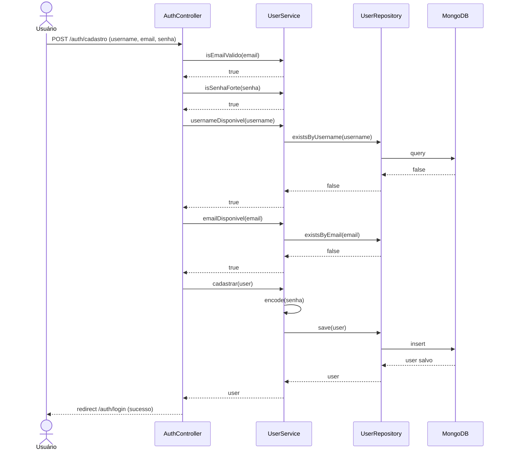
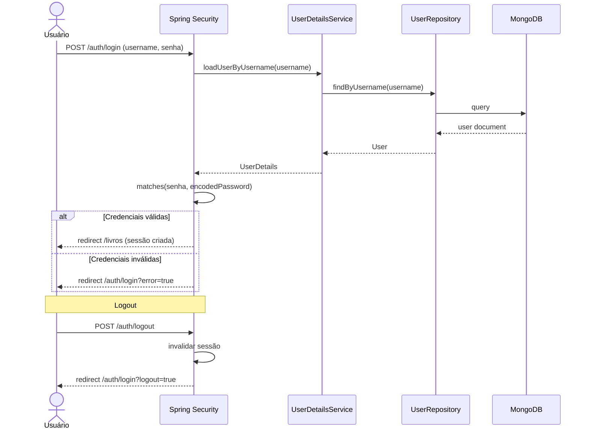
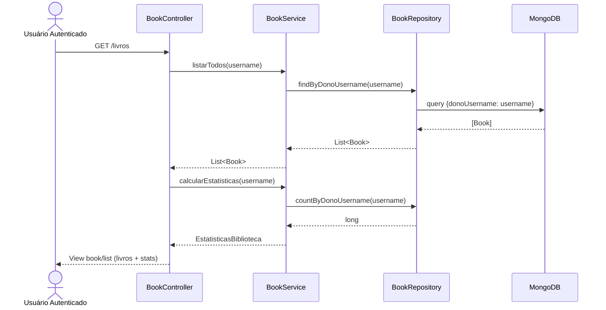
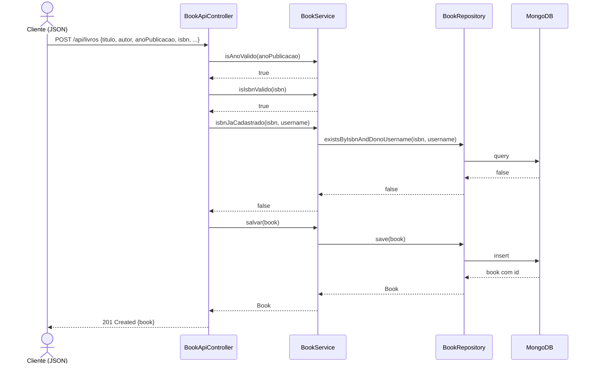
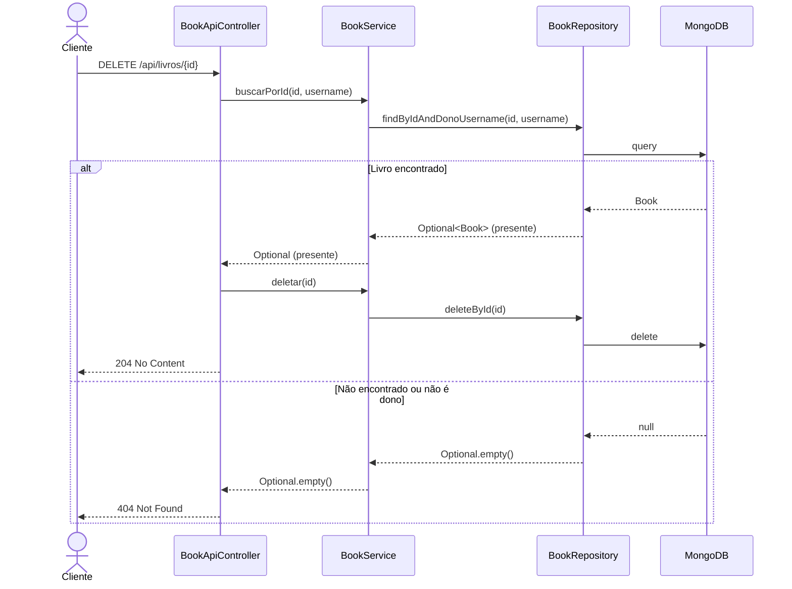
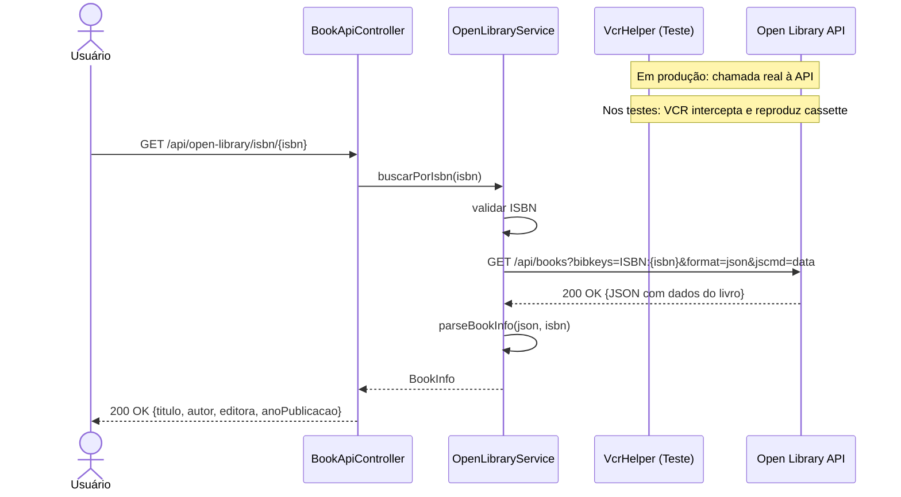
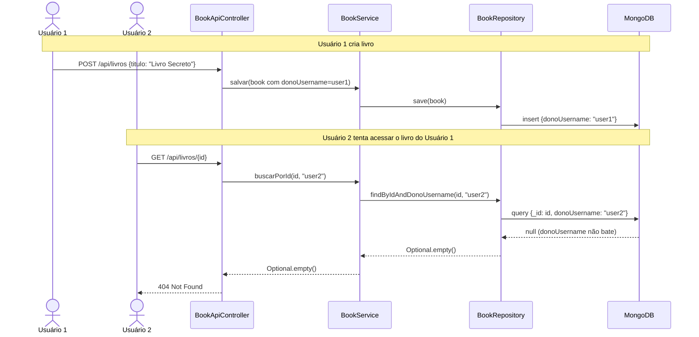

# RTM — Matriz de Rastreabilidade de Requisitos
## Gerenciador de Biblioteca Pessoal

---

## Índice

1. [Requisitos Funcionais](#requisitos-funcionais)
2. [Matriz de Rastreabilidade](#matriz-de-rastreabilidade)
3. [Diagramas UML de Sequência](#diagramas-uml-de-sequência)

---

## Requisitos Funcionais

| ID     | Requisito                                              | Prioridade |
|--------|--------------------------------------------------------|------------|
| RF-001 | Cadastro de novo usuário                               | Alta       |
| RF-002 | Autenticação (login/logout) com gerenciamento de sessão| Alta       |
| RF-003 | Listar livros do usuário autenticado                   | Alta       |
| RF-004 | Adicionar novo livro à biblioteca                      | Alta       |
| RF-005 | Editar dados de um livro existente                     | Alta       |
| RF-006 | Remover livro da biblioteca                            | Alta       |
| RF-007 | Filtrar livros por status de leitura                   | Média      |
| RF-008 | Buscar livros por título                               | Média      |
| RF-009 | Exibir estatísticas da biblioteca (totais por status)  | Média      |
| RF-010 | Buscar informações de livro por ISBN via API externa   | Baixa      |
| RF-011 | Validação de ISBN                                      | Média      |
| RF-012 | Validação de ano de publicação                         | Média      |
| RF-013 | Validação de email no cadastro                         | Alta       |
| RF-014 | Impedir ISBN duplicado para o mesmo usuário            | Média      |
| RF-015 | Usuário só acessa seus próprios livros                 | Alta       |

---

## Matriz de Rastreabilidade

| ID     | Requisito                            | Classe de Teste                          | Método(s) de Teste                                                                              | Tipo           |
|--------|--------------------------------------|------------------------------------------|-------------------------------------------------------------------------------------------------|----------------|
| RF-001 | Cadastro de usuário                  | `UserApiE2ETest`                         | `deveCadastrarUsuario`                                                                          | Caixa-Preta E2E|
| RF-001 | Cadastro de usuário                  | `AuthControllerTest`                     | `deveCadastrarERedirecionarParaLogin`                                                           | Caixa-Preta E2E|
| RF-001 | Cadastro de usuário                  | `UserServiceTest`                        | `deveCadastrarUsuario`                                                                          | Integração     |
| RF-002 | Autenticação / sessão                | `AuthControllerTest`                     | `deveRetornarPaginaLogin`, `deveRejeitarSenhasQueNaoCoincidem`                                  | Caixa-Preta    |
| RF-002 | Autenticação / sessão                | `BookControllerTest`                     | `deveRedirecionarParaLoginSemAuth`                                                              | Caixa-Preta    |
| RF-002 | Autenticação / sessão                | `BookApiE2ETest`                         | `semAutenticacaoRetorna401`                                                                     | Caixa-Preta    |
| RF-003 | Listar livros do usuário             | `BookApiE2ETest`                         | `deveRetornarListaVazia`                                                                        | Caixa-Preta E2E|
| RF-003 | Listar livros do usuário             | `BookServiceTest`                        | `deveListarApenasLivrosDoUsuario`                                                               | Integração     |
| RF-003 | Listar livros do usuário             | `BookControllerTest`                     | `deveRetornarListaParaUsuarioAutenticado`                                                       | Caixa-Preta    |
| RF-004 | Adicionar livro                      | `BookApiE2ETest`                         | `deveCriarLivro`, `deveRejeitarAnoInvalido`, `deveRejeitarIsbnDuplicado`                        | Caixa-Preta E2E|
| RF-004 | Adicionar livro                      | `BookServiceTest`                        | `deveSalvarERecuperarLivro`                                                                     | Integração     |
| RF-004 | Adicionar livro                      | `BookControllerTest`                     | `deveSalvarLivroERedirecionar`                                                                  | Caixa-Preta    |
| RF-005 | Editar livro                         | `BookApiE2ETest`                         | `deveAtualizarLivro`, `deveRetornar404AoAtualizarIdInexistente`                                 | Caixa-Preta E2E|
| RF-005 | Editar livro                         | `BookServiceTest`                        | `deveAtualizarStatusLeitura`                                                                    | Integração     |
| RF-005 | Editar livro                         | `BookControllerTest`                     | `deveRetornarFormularioEdicao`                                                                  | Caixa-Preta    |
| RF-006 | Remover livro                        | `BookApiE2ETest`                         | `deveDeletarLivro`, `deveRetornar404AoDeletarIdInexistente`                                     | Caixa-Preta E2E|
| RF-006 | Remover livro                        | `BookServiceTest`                        | `deveDeletarLivro`                                                                              | Integração     |
| RF-006 | Remover livro                        | `BookControllerTest`                     | `deveDeletarERedirecionar`                                                                      | Caixa-Preta    |
| RF-007 | Filtrar por status                   | `BookServiceTest`                        | `deveFiltrarPorStatus`                                                                          | Integração     |
| RF-007 | Filtrar por status                   | `BookControllerTest`                     | `deveFiltrarPorStatus`                                                                          | Caixa-Preta    |
| RF-008 | Buscar por título                    | `BookServiceTest`                        | `deveBuscarPorTitulo`                                                                           | Integração     |
| RF-008 | Buscar por título                    | `BookControllerTest`                     | `deveBuscarPorTitulo`                                                                           | Caixa-Preta    |
| RF-009 | Estatísticas                         | `BookApiE2ETest`                         | `deveRetornarEstatisticas`                                                                      | Caixa-Preta E2E|
| RF-009 | Estatísticas                         | `BookServiceTest`                        | `deveCalcularEstatisticas`                                                                      | Integração     |
| RF-010 | Busca ISBN via API externa (VCR)     | `OpenLibraryIntegrationTest`             | `deveBuscarInfoPorIsbn`, `deveSalvarLivroNoMongoDB`, `deveTratarIsbnNaoEncontrado`              | VCR + TC       |
| RF-011 | Validação de ISBN                    | `BookServiceTest`                        | `deveValidarIsbnCorreto`, `deveRejeitarIsbnInvalido`, `isbnNuloOuVazioEhValido` (parametrizados)| Caixa-Branca   |
| RF-012 | Validação de ano de publicação       | `BookServiceTest`                        | `deveValidarAnoPublicacao` (parametrizado com 5 cenários), `anoNuloDeveSerInvalido`             | Caixa-Branca   |
| RF-013 | Validação de email                   | `UserServiceTest`                        | `deveValidarEmailCorreto`, `deveRejeitarEmailInvalido`, `emailNuloDeveSerInvalido` (parametrizados)| Caixa-Branca|
| RF-013 | Validação de email                   | `UserApiE2ETest`                         | `deveRejeitarEmailInvalido`                                                                     | Caixa-Preta E2E|
| RF-013 | Validação de email                   | `AuthControllerTest`                     | `deveRejeitarEmailInvalido`                                                                     | Caixa-Preta    |
| RF-014 | ISBN duplicado                       | `BookApiE2ETest`                         | `deveRejeitarIsbnDuplicado`                                                                     | Caixa-Preta E2E|
| RF-014 | ISBN duplicado                       | `BookServiceTest`                        | `deveDetectarIsbnDuplicado`                                                                     | Integração     |
| RF-015 | Isolamento por usuário               | `BookApiE2ETest`                         | `naoDeveVerLivrosDeOutroUsuario`                                                                | Caixa-Preta E2E|
| RF-015 | Isolamento por usuário               | `BookServiceTest`                        | `deveListarApenasLivrosDoUsuario`, `buscaPorIdDeOutroUsuarioRetornaVazio`                       | Integração     |
| RF-015 | Isolamento por usuário               | `BookControllerTest`                     | `deveRedirecionarSeNaoForDono`                                                                  | Caixa-Preta    |

---

## Diagramas UML de Sequência

### RF-001 — Cadastro de Usuário

---

### RF-002 — Autenticação e Gerenciamento de Sessão

---

### RF-003 — Listar Livros

---

### RF-004 — Adicionar Livro (API REST)

---

### RF-006 — Remover Livro

---

### RF-010 — Busca ISBN via Open Library (VCR)

---

### RF-015 — Isolamento por Usuário

